# Senus PLC — AI-Native Board Report

A full-stack board reporting platform for Senus PLC, built for the Assiduous Technology Graduate technical assessment. Financial data enters the system via AI extraction from source PDFs, is validated in code before it's trusted, and powers a dashboard a CEO or board member would actually use — not just a demo of an AI call.

**Live app:** https://senusdash-production.up.railway.app
**Login:** credentials on request

---

## 1. Architecture

```
Source PDFs (local upload or Google Drive folder)
        |
        v
Extraction pipeline (board/extraction/)
  pdfplumber -> Gemini 2.5 Flash (JSON mode) -> Pydantic validation
  -> sign normalization -> cross-check vs. ground truth
        |
        v
ExtractionAttempt  (staging table, human-approval gate)
        |  promote (only if verified=True)
        v
SQLite database
  FinancialPeriod -> PLStatement / BalanceSheet / CashFlow / BusinessMetrics
  AIInsight (board commentary, generated from validated figures only)
        |
        v
Django REST Framework API  (token auth, one aggregate endpoint per period)
        |
        v
React + TypeScript + Vite dashboard
  6 report sections, Recharts, inline AI commentary, provenance badges,
  PDF board-pack export
```

Two AI pipelines feed the system, deliberately kept separate:

- **Extraction** (`board/extraction/pipeline.py`, `gemini_client.py`, `schemas.py`) — turns raw PDF text into structured numbers, validated against a schema and cross-checked against ground truth before anything is trusted.
- **Commentary** (`board/extraction/commentary.py`) — turns *already-validated* database figures into board-level prose. It never reads a raw document, only narrates numbers that already passed validation, so a narrative error and an extraction error can never be the same failure.

This split is deliberate: a single "read PDF, extract numbers, write commentary" call would make it impossible to tell whether a wrong figure in the final commentary came from bad extraction or bad narration.

---

## 2. Tech stack

**Backend:** Django 5, Django REST Framework, SQLite (dev), Pydantic (schema validation), pdfplumber (PDF text/table extraction), `google-genai` (Gemini 2.5 Flash), DRF Token Authentication, `google-api-python-client` + `google-auth` (Drive ingestion)

**Frontend:** React 19, TypeScript, Vite, Recharts

**AI:** Gemini 2.5 Flash — used for two distinct tasks: structured data extraction (JSON mode) and narrative commentary generation (plain text mode)

---

## 3. AI-assisted development workflow

Built with Claude (Anthropic) as an active development partner throughout — architecture decisions, debugging, iteration — and with Claude Code for local setup and the Google Drive ingestion integration. Noting this transparently since the process is itself relevant to a company evaluating AI-native engineering practices.

**What Claude was used for:** scoping the extraction pipeline's architecture before writing code, debugging real failures against real Gemini API behaviour as they happened, dashboard design-system decisions, and drafting this README.

**What I made the calls on:** keeping extraction and commentary as separate pipelines, requiring human approval (`ExtractionAttempt.verified`) before AI-extracted data can overwrite live figures rather than writing directly to the database, the dashboard's design direction, and scope/effort tradeoffs on later features (Drive integration, PDF export).

**Real debugging examples** (kept here as evidence the validation layer actually works, not just architecture on paper):

1. **Sign convention drift.** Gemini would sometimes return `operating_loss` as positive (matching how the source PDF displays it under a "Loss" heading) and sometimes negative, inconsistently across otherwise-identical calls. A better prompt alone wasn't reliable enough — the fix was enforcing sign conventions **in code** after extraction (`_normalize_signs()` in `pipeline.py`), designing around LLM non-determinism rather than trusting a good prompt to be sufficient.

2. **Column-matching failure.** Early P&L extraction attempts returned an empty JSON object. The source document showed two columns side by side (current period and prior-year comparative) with no explicit period label anywhere in the text, so Gemini had no way to map the internal period label to the correct column — and correctly returned nothing rather than guess. Fixed by passing the period's actual date range into the prompt and telling Gemini explicitly which column's dates to trust.

3. **The pipeline caught my own data entry gaps.** Several early cross-check "failures" (`development_costs`, `share_premium`, `other_operating_income`) turned out to be places where my manually-seeded ground truth was incomplete, not places where Gemini was wrong. Once corrected against the source document, those fields hit 100% match — the strongest evidence that the validation pipeline is a genuine two-way check, not just a filter on AI output.

4. **Scanned PDFs have no text layer.** Running extraction against Senus's actual statutory annual report (`ADF Farm Solutions Consolidated Financial Statements`, the company's registered legal name pre-rebrand) returned an empty JSON object for every statement type — `schema_invalid`, `raw_response: {}`. Root cause wasn't Gemini: `pdfplumber` found zero characters and zero extractable tables on every page (confirmed via `page.chars`), because the document is a scanned/photographed filing with one image per page, not a digitally-generated PDF with an embedded text layer. `pdf_utils.py` had no fallback for that case — it just sent Gemini an (empty) text excerpt, and Gemini correctly reported finding nothing rather than hallucinate. Fixed by adding `has_extractable_text()` (checks `page.chars` directly, cheaper than a failed extraction) and `extract_statement_from_pdf()` in `gemini_client.py`, which attaches the raw PDF bytes to the Gemini request instead of pre-extracted text — Gemini 2.5 Flash reads scanned pages natively as images, so this needed no separate OCR library. Result: 0% → 54–100% field match rate per statement across FY2024 and FY2025, with the review step (below) catching two remaining cases where Gemini's reading of a scanned column still disagreed with the source.

5. **Human review still found things the AI got wrong.** Even after the vision fallback fixed extraction outright, two `cash_flow` fields for FY2024 (`working_capital_movement`, `loans_net`) didn't match the source once checked by hand against the scanned cash flow statement — Gemini's reading merged two adjacent line items that should have stayed separate. Corrected manually from the source document rather than trusted as-extracted, and left visible in the `ExtractionAttempt` audit trail (`match_rate_pct: 80.0`) rather than silently overwritten to look like a clean pass. This is the human-approval gate (`ExtractionAttempt.verified`) doing its actual job, not a formality — FY2024 and FY2025 are marked `verified` because a human confirmed every field against the source, not because Gemini's raw output was assumed correct.

---

## 4. Data model & API

- `FinancialPeriod` (FY2024, FY2025, HY2025, HY2026) with one-to-one `PLStatement`, `BalanceSheet`, `CashFlow`, `BusinessMetrics` records
- `ExtractionAttempt` — full audit trail of every extraction run: raw Gemini output, schema validation status, per-field cross-check results, match rate, and a `verified` boolean gating promotion to live data
- `AIInsight` — one row per (period, section): generated commentary, model used, timestamp
- `FinancialPeriodViewSet` exposes a single aggregate `/api/periods/{id}/` endpoint returning all four statement types plus insights in one call, instead of five separate requests per period load

---

## 5. Google Drive ingestion

Source PDFs can be pulled directly from a shared Google Drive folder instead of uploaded manually, authenticated via a **service account** — no per-user OAuth login. The CEO/finance team just shares a Drive folder with the service account's email (Viewer access).

- `board/extraction/drive_client.py` — lists and downloads PDFs from a folder via the Drive API
- `board/management/commands/sync_drive_documents.py` — lists new PDFs in a folder, downloads each one not already processed for the given period, and runs it through the *same* `run_extraction()` pipeline used for local files — this is purely a document source, it doesn't change any extraction/validation logic

```bash
python manage.py sync_drive_documents --folder-id <drive-folder-id> --period HY2026
```

Safe to re-run: already-processed files (tracked via `ExtractionAttempt.source_document`, stored as `drive://{file_id}/{filename}`) are skipped automatically. Requires `GOOGLE_SERVICE_ACCOUNT_KEY_PATH` and the folder ID (see setup below).

---

## 5.5 "Connect Gmail" for notifications

Settings > Notifications > Email defaults to a "Connect Gmail" button instead of asking for SMTP host/username/password. It's a separate OAuth authorization-code flow from Google Sign-In (`GoogleLoginView`), requesting the `gmail.send` scope so the app can send notification emails via the Gmail API as the connecting admin's own account (`board/extraction/gmail_oauth.py`).

This reuses the existing `GOOGLE_OAUTH_CLIENT_ID`, but needs three things Google Sign-In didn't:

1. **Enable the Gmail API** for the Google Cloud project (APIs & Services > Library) — likely not yet enabled since only the Drive API has been used so far.
2. **Add the `gmail.send` scope** to the OAuth consent screen (APIs & Services > OAuth consent screen > Scopes). This is a "restricted" scope; that's fine while the app stays in Testing publishing status with a small list of test users (already the case for a board tool with a handful of reviewers) — no Google verification review needed.
3. **Set `GOOGLE_OAUTH_CLIENT_SECRET`** — get it from the same OAuth 2.0 Client ID's page in Credentials (APIs & Services > Credentials) that already provides `GOOGLE_OAUTH_CLIENT_ID`, and add it as an env var.

Without these, clicking "Connect Gmail" will fail with a clear error rather than silently doing nothing — falling back to "Use a different email provider" (Outlook/SendGrid/custom SMTP, or the `EMAIL_*` env vars) still works either way.

---

## 6. Assumptions made

- **HY2025 has no balance sheet** — the source document provided P&L and cash flow comparisons for HY2025 but not a standalone Dec-2024 balance sheet.
- **`net_investing_cash`** for early periods was derived (`net_cash_movement − net_operating_cash − net_financing_cash`) where the source didn't break it out explicitly.
- **BusinessMetrics is genuinely sparse across periods by design** — customer/ACV data came from a corporate presentation, market cap from a listing document, so no single period has both yet. The Returns section shows this honestly rather than fabricating figures.
- **Authentication is intentionally single-user/token-based** — appropriate scope for a board tool with one or a few trusted reviewers, not a general SaaS product requiring user management.

---

## 7. How outputs were validated

Every extracted figure passes the same four-stage gate before reaching the live dashboard:

1. **Schema validation** — Pydantic models mirroring the Django schema reject malformed or missing fields.
2. **Sign normalization** — known sign-convention fields (losses, liabilities) are forced to the correct sign in code, independent of what Gemini returned.
3. **Cross-check against ground truth** — each field is compared against manually-verified figures already in the database, 1% tolerance for rounding. A per-field match report is stored on the `ExtractionAttempt`.
4. **Human approval gate** — nothing writes to the live `PLStatement`/`BalanceSheet`/`CashFlow` tables automatically. A reviewer inspects match rate and cross-check detail in the Django admin and explicitly marks an attempt `verified` before promotion.

**Results on real Senus source documents (HY2026 half-year results):** P&L, Balance Sheet, and Cash Flow all reached 100% field match after fixing sign convention handling, ground-truth gaps, and (for Cash Flow) widening the section-extraction window to capture a statement that spans a page break in the source PDF.

The dashboard surfaces this directly via provenance badges — a board member can see whether a figure is AI-extracted-and-verified or manually entered, rather than that distinction staying an internal implementation detail.

---

## 8. Running locally

```bash
# Backend — from the repo root
cd assiduous_dash
python -m venv ../.venv
../.venv/Scripts/activate        # Windows; use ../.venv/bin/activate on macOS/Linux
pip install -r requirements.txt
python manage.py migrate
python manage.py seed_senus_data
python manage.py createsuperuser
python manage.py runserver

# Generate AI commentary (requires GEMINI_API_KEY)
python manage.py generate_insights --period HY2026

# Frontend — in a second terminal, from the repo root
cd senus-dashboard
npm install
npm run dev
```

**Environment variables** (`assiduous_dash/.env`):
| Variable | Required for |
|---|---|
| `GEMINI_API_KEY` | Extraction + commentary pipelines |
| `GOOGLE_SERVICE_ACCOUNT_KEY_PATH` | Google Drive ingestion only |
| `DRIVE_FOLDER_ID` | Google Drive ingestion only |
| `GOOGLE_OAUTH_CLIENT_SECRET` | "Connect Gmail" notifications only (§5.5) — Google Sign-In itself only needs `GOOGLE_OAUTH_CLIENT_ID` |
| `SLACK_WEBHOOK_URL` | Optional fallback — posts a Slack message when an extraction attempt completes. Prefer setting this from Settings > Notifications in the app (admin only), which takes precedence over this env var; use the env var for deployments where you don't want it editable from the UI |
| `TEAMS_WEBHOOK_URL` | Optional fallback — posts a Microsoft Teams Adaptive Card when an extraction attempt completes. Same DB-over-env precedence as `SLACK_WEBHOOK_URL` above |
| `EMAIL_BACKEND`, `EMAIL_HOST`, `EMAIL_PORT`, `EMAIL_HOST_USER`, `EMAIL_HOST_PASSWORD`, `EMAIL_USE_TLS`, `DEFAULT_FROM_EMAIL` | Optional fallback — defaults to Django's console backend (prints to the terminal). Prefer setting SMTP host/port/username/password/from-address from Settings > Notifications in the app (admin only), which takes precedence over these env vars |

For local development, `SECRET_KEY` falls back to a hardcoded dev value and the database defaults to SQLite. In production (deployed on Railway, see above), `SECRET_KEY` and `DATABASE_URL` are read from the environment — Railway provisions a managed Postgres instance and injects `DATABASE_URL` automatically, which `settings.py` picks up via `dj_database_url` in place of the SQLite fallback.

---

## 9. What I'd build next with more time

- Extend the OCR/vision fallback (see §3.4) with a genuine hybrid mode — use pdfplumber's text where a page has it and only fall back to vision per-page, rather than per-document, for mixed scanned/digital PDFs
- Trigger `sync_drive_documents` automatically on new file upload (Drive push notifications / a scheduled poll) instead of a manual CLI run
- A natural-language query interface over the board data (Gemini function-calling against the DRF API) — a genuine "ask the board report a question" feature


## 10 ER Diagram

```mermaid
erDiagram
    %% ============ CENTRAL HUB ============
    FinancialPeriod {
        bigint id PK
        char label
        char period_type
        date start_date
        date end_date
        boolean is_audited
        text notes
    }

    User {
        bigint id PK
    }

    %% ============ FINANCIAL STATEMENTS ============
    BalanceSheet {
        bigint id PK
        decimal cash
        decimal tangible_assets
        decimal goodwill
        decimal debtors
        decimal current_creditors
        decimal long_term_debt
        decimal loans_net
        decimal share_capital
        decimal share_premium
        decimal retained_earnings
        decimal equity_raised
        decimal development_costs
        decimal contingent_consideration
    }

    PLStatement {
        bigint id PK
        decimal revenue
        decimal cost_of_sales
        decimal gross_profit
        decimal admin_expenses
        decimal distribution_costs
        decimal operating_loss
        decimal other_operating_income
        decimal interest_expense
        decimal loss_before_tax
        decimal tax_expense
        decimal loss_after_tax
    }

    CashFlow {
        bigint id PK
        decimal opening_cash
        decimal closing_cash
        decimal net_operating_cash
        decimal net_investing_cash
        decimal net_financing_cash
        decimal net_cash_movement
        decimal working_capital_movement
        decimal depreciation
        decimal equity_raised
    }

    BusinessMetrics {
        bigint id PK
        int employees
        int total_customers
        int enterprise_customers
        decimal revenue_ireland_pct
        decimal acv_era_per_enterprise
        decimal acv_soil_per_enterprise
        decimal market_cap
        decimal share_price
        decimal pipeline_value
        int pipeline_deals_count
    }

    %% ============ AI / EXTRACTION PIPELINE ============
    ExtractionAttempt {
        bigint id PK
        char statement_kind
        char source_document
        char source_content_hash
        char model_used
        json raw_response
        json cross_check_results
        decimal match_rate_pct
        char status
        boolean verified
        text error_message
    }

    AIInsight {
        bigint id PK
        char section
        text generated_text
        char model_used
        char source_data_hash
        datetime generated_at
    }

    AdvisoryGoal {
        bigint id PK
        char title
        text description
        text rationale
        smallint order
        char status
        char model_used
        datetime committed_at
    }

    ReportSpec {
        bigint id PK
        char title
        char audience_label
        text context_note
        boolean include_cash_liquidity
        boolean include_profitability
        boolean include_revenue_growth
        boolean include_solvency_leverage
        boolean include_returns
        boolean include_outlook
        boolean use_tailored_narrative
        json tailored_narrative
        boolean narrative_approved
    }

    BoardQuestion {
        bigint id PK
        text question
        text answer
        json context_chunks
        json figures_snapshot
        json graph_triples
        char model_used
    }

    %% ============ RAG / KNOWLEDGE GRAPH ============
    VectorDocumentChunk {
        bigint id PK
        char source_document
        char statement_kind
        int page_number
        int chunk_index
        text text
        vector embedding
        char embedding_model
    }

    KnowledgeGraphNode {
        bigint id PK
        char name
        char node_type
        text description
        json metadata
    }

    KnowledgeGraphEdge {
        bigint id PK
        char edge_type
        json metadata
    }

    %% ============ STANDALONE ============
    FundingRoadmapStep {
        bigint id PK
        char title
        text description
        char timeframe
        smallint order
        char model_used
    }

    EcosystemChecklistItem {
        bigint id PK
        char title
        slug key
        text description
        text notes
        smallint order
        char status
    }

    %% ============ RELATIONSHIPS ============
    FinancialPeriod ||--o{ BalanceSheet : "balance_sheet"
    FinancialPeriod ||--o{ PLStatement : "pl_statement"
    FinancialPeriod ||--o{ CashFlow : "cash_flow"
    FinancialPeriod ||--o{ BusinessMetrics : "business_metrics"
    FinancialPeriod ||--o{ ExtractionAttempt : "extraction_attempts"
    FinancialPeriod ||--o{ AIInsight : "ai_insights"
    FinancialPeriod ||--o{ AdvisoryGoal : "advisory_goals"
    FinancialPeriod ||--o{ ReportSpec : "report_specs"
    FinancialPeriod ||--o{ BoardQuestion : "board_questions"
    FinancialPeriod ||--o{ VectorDocumentChunk : "document_chunks"
    FinancialPeriod ||--o{ FundingRoadmapStep : "funding_roadmap_steps"

    VectorDocumentChunk ||--o{ KnowledgeGraphNode : "graph_nodes"
    KnowledgeGraphNode ||--o{ KnowledgeGraphEdge : "outgoing_edges (source)"
    KnowledgeGraphNode ||--o{ KnowledgeGraphEdge : "incoming_edges (target)"

    User ||--o{ AdvisoryGoal : "committed_by"
    User ||--o{ ReportSpec : "created_by"
    User ||--o{ ReportSpec : "narrative_approved_by"
    User ||--o{ BoardQuestion : "asked_by"
    User ||--o{ EcosystemChecklistItem : "updated_by"
```


